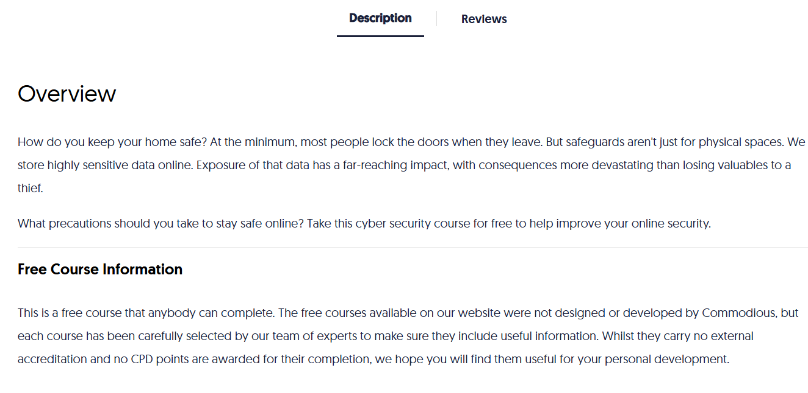
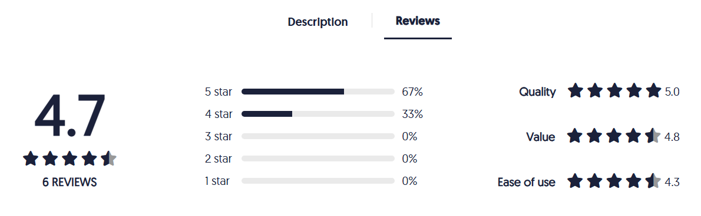

# 🔐 Online Security Fundamentals – Commodious 

    

This repository contains **notes, labs, playbooks, case studies, and certificate of completion** for the *Online Security Fundamentals* course on **Commodious**.  
The training provides essential knowledge for **safe browsing, phishing awareness, email security, password management, and incident reporting**.  

---

## 📚 Notes  

- 📄 [`01-introduction.md`](./notes/01-introduction.md) – Course introduction  
- 📄 [`02-cybersecurity-basics.md`](./notes/02-cybersecurity-basics.md) – Cybersecurity basics  
- 📄 [`03-online-threats.md`](./notes/03-online-threats.md) – Online threats overview  
- 📄 [`04-safe-browsing.md`](./notes/04-safe-browsing.md) – Safe browsing practices  
- 📄 [`05-email-security.md`](./notes/05-email-security.md) – Email security essentials  
- 📄 [`06-passwords-mfa.md`](./notes/06-passwords-mfa.md) – Passwords & MFA  
- 📄 [`07-device-security.md`](./notes/07-device-security.md) – Device security  
- 📄 [`08-social-engineering.md`](./notes/08-social-engineering.md) – Social engineering threats  

---

## 🧪 Labs  

- 🔑 [`password-security-lab.md`](./labs/password-security-lab.md) – Practicing strong passwords & MFA  
- 🎣 [`phishing-awareness-lab.md`](./labs/phishing-awareness-lab.md) – Phishing detection & awareness  
- 🌐 [`safe-practices-lab.md`](./labs/safe-practices-lab.md) – Safe browsing and online practices  

---

## 📑 Playbooks  

- 🎣 [`phishing-response-playbook.md`](./playbooks/phishing-response-playbook.md) – Response to phishing attacks  
- 🔐 [`password-compromise-playbook.md`](./playbooks/password-compromise-playbook.md) – Handling password compromise  
- 🦠 [`malware-infection-playbook.md`](./playbooks/malware-infection-playbook.md) – Malware infection response  
- 📑 [`incident-reporting-playbook.md`](./playbooks/incident-reporting-playbook.md) – Standardized incident reporting  

---

## 🔬 Extras  

- 📑 [`case-studies.md`](./extras/case-studies.md) – Real-world online security cases  
- 📚 [`resources.md`](./extras/resources.md) – Additional learning resources  
- 📆 [`timeline.md`](./extras/timeline.md) – Study timeline  

---

## 📖 Docs  

- 📘 [`glossary.md`](./docs/glossary.md) – Glossary of terms  
- 📘 [`index.md`](./docs/index.md) – Repository index  
- 📘 [`references.md`](./docs/references.md) – References  
- 📘 [`roadmap.md`](./docs/roadmap.md) – Learning roadmap  
- 📘 [`syllabus.md`](./docs/syllabus.md) – Course syllabus  

---

## 📸 Screenshots  

| Content | Screenshot |
|---------|------------|
| 📑 Course Description |  |
| ⭐ Reviews |  |

---

## 📜 Certificate  

🎓 [`Online Security Fundamentals`](./cert/Online-Security-Fundamentals.png)  

---

## 📝 Personal Review  

This course covered the **essentials of staying safe online**, focusing on the human factor in cybersecurity.  
I found the **phishing awareness** and **safe browsing modules** especially practical, and the **playbooks** provide structured response strategies for real-life scenarios.  

It’s a solid beginner-friendly course to strengthen **personal and organizational cybersecurity hygiene**.  

---

## ✍️ Author  

**Thành Danh** – Red Team Learner & Security Researcher  

- GitHub: [@ngvuthdanhh](https://github.com/ngvuthdanhh)  
- Email: ngvu.thdanh@gmail.com  

---

## 📄 License  

This project is licensed under the terms of the **MIT License**.  
See [`LICENSE`](./LICENSE) for details.  

© 2025 ngvuthdanhh. All rights reserved.  
